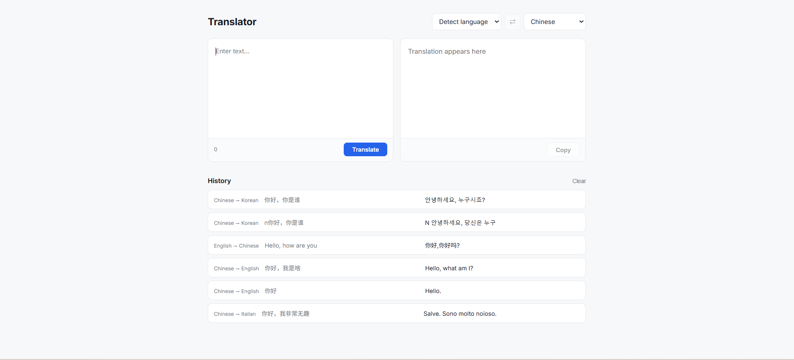

# Translator Platform

A multilingual Transformer serving system built around Hugging Face models,
with explicit model routing, lazy loading, caching, async jobs, observability,
and a public demo.

**Live demo:** https://bartonhou.github.io/Translator/



## Why this project exists

Translation models are easy to call in a notebook and much harder to operate as
a real service. This project focuses on the systems problems around inference:

- how to route different language pairs across heterogeneous models,
- how to keep GPU / RAM use bounded as models are loaded,
- how to avoid recomputing repeated translations,
- how to separate low-latency requests from long-running jobs,
- and how to make failures and latency visible in production.

The result is a complete serving stack rather than a thin wrapper around
`transformers.pipeline`.

## System design

```text
                    ┌──────────────┐
                    │ React client │
                    └──────┬───────┘
                           │
                           ▼
                    ┌──────────────┐
                    │ FastAPI API  │
                    └──────┬───────┘
                           │
              ┌────────────┼────────────┐
              ▼            ▼            ▼
        model routing   Redis cache   async jobs
              │            │            │
              ▼            │            ▼
      lazy model manager   │          Celery
              │            │            │
              ▼            │            ▼
       HF seq2seq models   │        PostgreSQL
```

## Model routing

The service currently combines two inference families:

- dedicated `Helsinki-NLP/opus-mt-*` models for several European languages
  and Chinese,
- `facebook/nllb-200-distilled-600M` for Japanese/Korean paths where the
  available OPUS models performed poorly.

For non-English OPUS pairs, the router can use English as an intermediate
pivot. NLLB paths are translated directly.

The routing layer is deliberately separate from request handling so model
selection can be changed without rewriting the API.

## Model lifecycle and memory

`app/inference/model_manager.py` owns model loading rather than letting request
handlers instantiate models directly.

Key behaviors include:

- lazy model loading,
- a bounded LRU-style resident-model cache,
- persistent Hugging Face model files on disk,
- optional warmup of selected language pairs,
- CPU / CUDA device selection,
- fp16 on supported GPU paths.

This keeps the serving layer usable on machines that cannot hold every model in
memory simultaneously.

## Inference and caching

The inference layer supports:

- sentence-aware translation,
- duplicate-sentence elimination within a request,
- text-level and sentence-level Redis caching,
- streaming SSE output,
- synchronous requests for bounded workloads,
- asynchronous Celery jobs for larger batches.

Cache keys include the model and generation parameters so changing inference
settings does not accidentally reuse incompatible outputs.

## Multi-tenant API behavior

The backend also includes infrastructure that is easy to omit in ML demos:

- JWT authentication,
- per-user API keys stored as hashes,
- per-key rate limits,
- monthly character quotas,
- PostgreSQL job persistence,
- Alembic schema migrations,
- callback webhooks for async jobs.

## Observability

The service exposes:

- `/health` for liveness,
- `/ready` for Redis/Postgres readiness,
- `/metrics` for Prometheus,
- request IDs propagated into structured logs.

Metrics cover request volume, translation latency, cache behavior, model load
time, quota/rate-limit events, and async jobs.

Prometheus and Grafana can be started through the provided Docker Compose
overlay.

## Repository map

- `app/core/orchestrator.py` — sync/async policy and request orchestration
- `app/core/routing.py` — language-pair to model routing
- `app/inference/model_manager.py` — lazy loading and resident-model lifecycle
- `app/inference/engine.py` — sentence splitting, deduplication, and inference
- `workers/tasks.py` — background job execution
- `frontend/` — Vite + React client
- `alembic/` — database migrations
- `deploy/` — deployment-specific configurations and public-demo path
- `tests/` — backend tests with heavy ML dependencies stubbed for fast CI

## Public demo vs. full stack

The public demo intentionally uses a reduced deployment path:

- GitHub Pages hosts the frontend.
- A Hugging Face Space hosts a minimal translation backend.
- The public path does not run PostgreSQL, Redis, or Celery.

The full local/self-hosted stack includes all of those services. Keeping the
demo deployment separate avoids pretending that the free hosted demo exercises
the complete production architecture.

## Quick start

### Docker / CPU

```bash
make up
```

### Docker / NVIDIA GPU

```bash
make gpu
```

Services:

- frontend: `http://localhost:8080`
- API docs: `http://localhost:8000/docs`
- health: `http://localhost:8000/health`
- metrics: `http://localhost:8000/metrics`

## Testing

Backend:

```bash
python -m venv .venv
source .venv/bin/activate
pip install -e ".[dev]"
pytest
```

The backend suite stubs heavyweight ML dependencies so most system behavior can
be tested without downloading models or requiring a GPU.

Frontend:

```bash
cd frontend
npm test
```

## Supported languages

Current registry:

`en`, `es`, `fr`, `de`, `it`, `pt`, `ja`, `ko`, `zh`

Call `GET /v1/models` for the exact routing path used by each pair.

## API examples

Synchronous translation:

```bash
curl -X POST http://localhost:8000/v1/translate \
  -H "Content-Type: application/json" \
  -H "X-API-Key: dev-api-key" \
  -d '{
    "source_lang": "en",
    "target_lang": "es",
    "texts": ["The contract is ready for review."]
  }'
```

Streaming:

```bash
curl -N -X POST http://localhost:8000/v1/translate/stream \
  -H "X-API-Key: dev-api-key" \
  -H "Content-Type: application/json" \
  -d '{"source_lang":"en","target_lang":"fr","text":"First sentence. Second sentence."}'
```

Async jobs:

- `POST /v1/jobs`
- `GET /v1/jobs/{job_id}`
- `GET /v1/jobs/{job_id}/result`

## Scope

This project is an **ML systems / NLP infrastructure project**, not a claim of a
new translation model or translation-quality research result.

The interesting work is the boundary between pretrained Transformer models and
a usable service: routing, memory management, caching, concurrency, persistence,
observability, and deployment.
